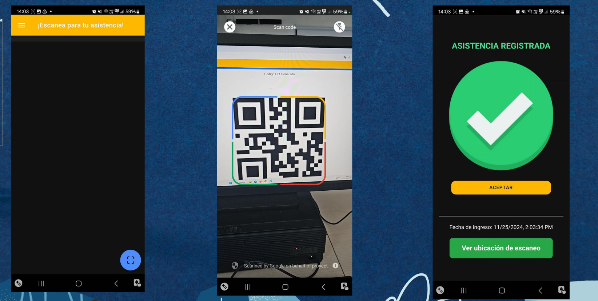
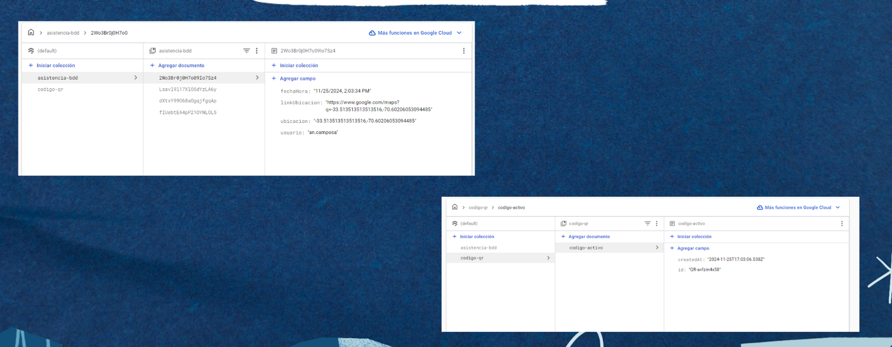

# RegistrApp – QR Attendance System

RegistrApp es una aplicación móvil multiplataforma para el **registro de asistencia mediante códigos QR**, diseñada para reemplazar procesos manuales por una solución digital, rápida y centralizada en la nube.

El proyecto está orientado a entornos reales como instituciones educativas, capacitaciones y control básico de accesos.

## Descripción General

RegistrApp permite a los usuarios autenticarse, escanear un código QR y registrar su asistencia en tiempo real.  
Cada registro queda almacenado de forma segura en Firebase, incluyendo **fecha, hora, usuario y ubicación**, facilitando la trazabilidad y validación de la información.

## Problema y Solución:

### * Problema
- Registro manual lento y propenso a errores  
- Falta de control y auditoría  
- Información descentralizada  

### * Solución
- Automatización del proceso mediante códigos QR  
- Registro centralizado en la nube  
- Validación inmediata del ingreso  

## Imagenes

## Funcionalidades Principales

- Escaneo de códigos QR desde la cámara del dispositivo  
- Registro automático de asistencia  
- Validación de usuarios  
- Almacenamiento en Firebase Firestore  
- Registro de fecha, hora y ubicación  
- Interfaz simple e intuitiva  

## 🛠️ Tecnologías Utilizadas

- **Framework móvil:** Ionic Angular  
- **Lenguaje:** TypeScript  
- **Backend / Cloud:** Firebase  
  - Authentication  
  - Firestore Database  
- **Build & Deploy:** Capacitor  
- **Control de versiones:** Git & GitHub  

## 🧠 Flujo del Sistema

1. El usuario inicia sesión  
2. Escanea un código QR  
3. El sistema valida el código  
4. Se registra la asistencia en la base de datos  
5. Se muestra confirmación al usuario  
